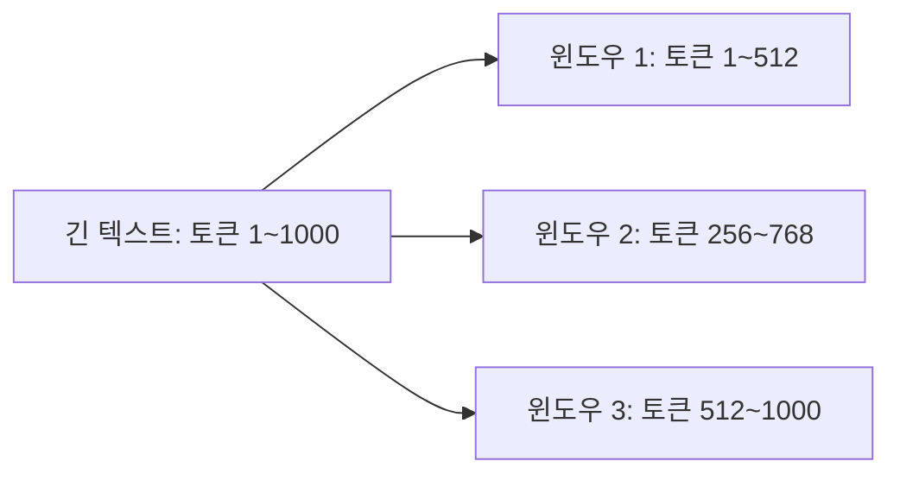

루이스 턴스톨

다음 문서는 책을 읽으면서 이해가 안가는 부분을 Deepseek을 통해 알아본 바를 정리한 것이 대부분이다. 

### Chapter4. 다중 언어 개체명 인식
#### 4.9 오류분석
loss = cross_entropy(output.logits.view(-1,7), labels.view(-1), reduction="none")

pandas.Series.explode() 함수 -> 리스트에 있는 각 원소를 하나의 행으로 만들 수 있음

누적 손실이 가장 큰 토큰을 찾는다. 

165 
실버 스탠다드 - 레이블이 자동생성
골드 스탠다드 - 사람이 생성한 레이블


#### 4.10 교차 언어 전이
TrainingArguments`의 `logging_steps` 매개변수를 훈련 세트 크기에 맞춰 조정하는 주된 이유는 **로그의 빈도와 정보량을 최적화**하기 위함입니다. 구체적인 이유는 다음과 같습니다:

---

##### 1. **로그의 유의미성 보장**

- 훈련 세트가 클수록 한 번의 에포크(epoch)에 더 많은 스텝(step)이 필요합니다.
    
    - 예: 훈련 세트가 10,000개의 샘플이고 `batch_size=10`이면, 1에포크당 1,000스텝이 필요합니다.
        
- `logging_steps`를 고정된 값(예: 10)으로 두면, 큰 데이터셋에서는 로그가 너무 자주 출력되어 불필요한 정보가 쌓일 수 있습니다.
    
- 반대로 작은 데이터셋에서는 로그가 너무 드물어 훈련 진행 상황을 파악하기 어려울 수 있습니다.
    
- **조정 목적**: 에포크당 로그 빈도를 적절히 분배해 훈련 과정을 효과적으로 모니터링.
    

---

##### 2. **계산 오버헤드 감소**

- 로그를 기록할 때마다 추가 계산이 발생합니다(예: 손실 계산, 메트릭 평가).
    
- 대규모 데이터셋에서 로그 스텝이 너무 짧으면(예: 매 10스텝), 불필요한 리소스 낭비가 발생할 수 있습니다.
    
- **조정 목적**: 로그로 인한 오버헤드를 줄이면서도 충분한 정보를 제공.
    

---

##### 3. **에포크와의 균형 맞추기**

- 일반적으로 사용자는 "에포크" 단위로 훈련 진행 상황을 직관적으로 이해합니다.
    
- `logging_steps`를 훈련 세트 크기와 배치 크기에 따라 조정하면, **에포크당 일정 횟수의 로그**를 보장할 수 있습니다.
    
    - 예: 1에포크당 10번 로그를 출력하려면, `logging_steps = (데이터셋 크기 / batch_size) / 10`.
        

---

##### 4. **일반적인 권장 사항**

- Hugging Face의 `Trainer`에서는 기본값으로 `logging_steps=500`을 사용하지만, 데이터셋 크기에 따라 다음과 같이 조정하는 것이 좋습니다.
    
- **실전 예시**:
    
    - 데이터셋 크기: 50,000, `batch_size=50` → 1에포크당 1,000스텝.
        
    - `logging_steps=100`으로 설정하면 1에포크당 10번 로그 출력.
        

---

##### 결론

`logging_steps`를 훈련 세트 크기와 배치 크기에 맞춰 조정하면 **리소스 효율성**과 **모니터링 편의성**을 동시에 확보할 수 있습니다. 너무 빈번하거나 드문 로그는 훈련 과정 분석에 방해가 될 수 있으므로, 데이터셋 규모와 훈련 목적에 따라 적절한 값을 선택해야 합니다.

이 문장이 요구하는 함수의 역할을 **초보자도 이해하기 쉽게** 설명해드리겠습니다.  

---

##### **쉽게 이해하기: "이 함수는 무슨 일을 하나요?"**  
1. **입력**:  
   - **단일 언어 말뭉치** (예: 한국어 텍스트 데이터셋)가 들어있는 `DatasetDict` 객체.  
     - `DatasetDict`는 Hugging Face 라이브러리에서 사용하는 데이터 형식으로, 보통 `train`(훈련 데이터)과 `validation`(검증 데이터)으로 구성됩니다.  
   - `num_samples`: 전체 데이터 중에서 **몇 개의 샘플을 사용할지** (예: 1,000개).  

2. **처리**:  
   - 데이터셋에서 `num_samples`만큼 **무작위로 샘플링**합니다.  
   - **XLM-R 모델** (다국어 모델)을 받아와서, 샘플링된 데이터로 **미세 튜닝**합니다.  
     - 미세 튜닝(Fine-tuning)은 모델을 특정 작업(예: 감정 분석)에 맞게 조정하는 과정입니다.  

3. **출력**:  
   - 훈련 과정에서 **가장 높은 점수**를 기록한 에포크(epoch)의 **평가 결과**를 반환합니다.  
     - 예: 정확도(accuracy) 90%, F1-score 0.85 등.  

---

##### **예시로 이해하기**  
- **가정**:  
  - 입력 데이터: `DatasetDict` 객체 (예: 한국어 영화 리뷰 데이터셋).  
  - `num_samples`: 1,000 (1,000개의 리뷰만 무작위로 선택).  

- **함수의 작업 흐름**:  
  1. 1,000개의 리뷰를 무작위로 고릅니다.  
  2. XLM-R 모델을 이 데이터로 학습시켜 영화 리뷰 감정 분석기를 만듭니다.  
  3. 학습 중 **가장 좋은 성능**을 보인 시점의 점수(예: 정확도 88%)를 반환합니다.  

---

##### **코드 예시 (간략화)**  
```python
from transformers import XLMRobertaForSequenceClassification, Trainer

def train_and_evaluate(dataset, num_samples):
    # 1. 데이터 샘플링
    small_train = dataset["train"].shuffle().select(range(num_samples))
    
    # 2. XLM-R 모델 불러오기
    model = XLMRobertaForSequenceClassification.from_pretrained("xlm-roberta-base")
    
    # 3. 미세 튜닝 설정 및 실행
    trainer = Trainer(model=model, train_dataset=small_train, ...)
    trainer.train()
    
    # 4. 최고 점수 반환 (예: 검증 정확도)
    eval_result = trainer.evaluate()
    return eval_result["eval_accuracy"]
```

---

##### **왜 이런 함수가 필요할까요?**  
- 대용량 데이터를 전부 학습시키면 시간/비용이 많이 들기 때문에, **소량의 샘플로 빠르게 실험**하기 위함입니다.  
- XLM-R 같은 다국어 모델을 **특정 언어(예: 한국어)에 최적화**할 때 유용합니다.  

이해가 되셨나요? 😊

-  훈련 샘플이 750개 일 때까지 제로샷 전이가 타언어로 미세튜닝한 것보다 앞선다. 

##### 4.10.2 다국어에서 동시에 미세 튜닝하기

-  각언어 말뭉치에서 미세 튜닝(train_on_subset 함수를 이용) 후 각 언어로 구성된 다국어 말뭉치를 만든다. -> 이 말뭉치로 Trainer를 실행
- 한 어족 내에서 교차 언어 전이에 초점을 맞추는 것이 좋음
-  Mad-x 같은 연구 - 데이터가 부족한 상황을 위해 설계


### Chapter 5. 텍스트 생성

- 모델의 확률 출력을 텍스트로 변환하려면 디코딩 방법이 필요함
- GPT-2는 문맥 시퀀스가 주어질 때 텍스트에 등장하는 토큰 시퀀스의 확률을 추정하도록 사전 훈련됨 -> 확률을 구하기 위해 확률의 연쇄 법칙을 사용해 조건부 확률의 곱으로 나타냄

-  **언어 모델이 텍스트 생성 과정에서 모든 가능한 시퀀스를 평가해야 최적의 y(예측값)를 찾을 수 있다**

1. **"y의 추정치"란?**  
   - 언어 모델의 목표는 주어진 입력(예: 이전 단어들)에 대해 **다음에 올 단어(y)의 확률 분포**를 예측하는 것입니다.  
   - 여기서 **y**는 모델이 예측해야 할 대상(단어 또는 토큰)을 의미하며, "추정치"는 모델이 계산한 확률 기반의 최적 예측값을 말합니다.

2. **"가능한 모든 시퀀스 평가"의 의미**  
   - 언어 모델은 각 시점에서 **모든 후보 단어(vocabulary 크기만큼)**에 대해 점수(확률)를 계산합니다.  
     예: Vocabulary가 50,000개 단어라면, 매 단계마다 50,000개 확률을 평가합니다.  
   - **전체 시퀀스(문장)를 생성할 때**는 모든 가능한 조합(`y_1, y_2, ..., y_n`)을 고려해야 하지만, 실제로는 계산 비용이 너무 높아 **근사화 기법**을 사용합니다(예: Greedy Search, Beam Search).

3. **실제 생성 과정에서의 적용**  
   - **Exhaustive Search(완전 탐색)**: 모든 가능한 시퀀스의 확률을 비교해 최적의 문장을 선택합니다. 하지만 단어 조합이 기하급수적으로 늘어나 **비현실적**입니다.  
   - **Beam Search**: Top-k 후보만 유지하며 계산 효율성을 높입니다.  
   - **샘플링 기법**: Temperature Scaling이나 Nucleus Sampling으로 다양성을 보장합니다.

 요약  
- 이 문장은 **이론적으로** 언어 모델이 완벽한 예측을 하려면 모든 경우의 수를 평가해야 하지만, **실제로는 근사적 방법**을 사용한다는 배경 지식을 담고 있습니다.  
- 현실에서는 계산 한계로 인해 Heuristic(탐욕적 방법) 또는 확률적 샘플링으로 대체됩니다.  

예시:  
입력: "오늘 날씨가" → 모델은 "맑다", "흐리다", "춥다" 등 모든 후보의 확률을 평가한 후 가장 높은 확률의 단어를 선택합니다.


- **그리디 서치(Greedy Search Decoding)**는 언어 모델이 텍스트를 생성할 때 **매 단계에서 가장 확률이 높은 단어를 선택하는 가장 간단한 디코딩 방법**


- 트랜스포머 모델에서 `generate()` 함수를 사용할 때 **샘플링을 끄는 이유**는 주로 **결정적(deterministic)이고 안정적인 출력**을 얻기 위함입니다. 샘플링을 비활성화하면 모델은 확률 분포에서 무작위성을 제거하고 **항상 가장 확률이 높은 단어를 선택**하는 방식(그리디 서치 또는 빔 서치)으로 동작합니다. 구체적인 이유와 시나리오는 다음과 같습니다:

---

 1. **결정적 출력 필요성**  
- **실험/평가 시**:  
  - 모델 성능을 비교하거나 디버깅할 때 **동일 입력에 대해 항상 같은 출력**이 나와야 재현성이 보장됩니다.  
  - 샘플링을 사용하면 실행마다 다른 결과가 생성되어 평가가 어려워집니다.  
- **프로덕션 환경**:  
  - 사용자에게 일관된 응답을 전달해야 하는 경우(예: FAQ 챗봇, 의료 진단 보조).  

---

2. **안정성 보장**  
- 샘플링(Top-k, Top-p, Temperature)은 **다양성**을 높이지만, **잠재적 위험**을 동반합니다:  
  - **비문 생성**: 낮은 확률의 부적절한 단어가 선택될 수 있음.  
  - **일관성 저하**: 장문 생성에서 논리적 흐름이 깨질 수 있음.  
- 샘플링을 끄면 모델은 **확실성이 높은 단어**만 선택하므로 출력의 안정성이 향상됩니다.  

---

3. **그리디 서치/빔 서치와의 관계**  
- 샘플링을 끄면 기본적으로 **그리디 서치**(`num_beams=1`) 또는 **빔 서치**(`num_beams>1`)가 활성화됩니다.  
  - **그리디 서치**: 매 스텝에서 최고 확률 단어 선택 → 빠르지만 최적이 아닐 수 있음.  
  - **빔 서치**: 여러 후보를 유지하며 최적 시퀀스 탐색 → 더 긴 문장에 효과적.  

---

4. **샘플링 비활성화 방법**  
트랜스포머(HuggingFace)에서 다음과 같이 설정합니다:  
```python
output = model.generate(
    input_ids,
    do_sample=False,  # 샘플링 비활성화 → 그리디/빔 서치 사용
    num_beams=5,      # 빔 서치 적용 (do_sample=False일 때 기본값 1)
    early_stopping=True
)
```

---

5. **적합한 사용 사례**  
- **의미적 정확성**이 중요한 작업:  
  - 기계 번역(Machine Translation), 요약(Summarization).  
- **안전성**이 요구되는 응용:  
  - 법률/의료 문서 생성, 금융 보고서.  

---

🚨 **주의점**  
- **단조로운 출력**: 샘플링을 끄면 반복적이거나 창의성이 부족한 텍스트가 생성될 수 있습니다.  
- **빔 서치의 계산 비용**: `num_beams`가 클수록 메모리와 시간이 증가합니다.  

 ✅ **요약**  
샘플링을 끄는 것은 **재현성, 안정성, 결정적 출력**이 필요할 때 선택하며, 그리디/빔 서치를 통해 모델의 예측을 최대한 보수적으로 제어하는 목적이 있습니다. 반면 창의적이거나 다양한 출력이 필요할 때는 샘플링 기법을 활성화합니다.

#### 5.3 빔서치 디코딩

트랜스포머 모델이 **"정규화되지 않은 로짓(unnormalized logits)"**을 반환한다는 것은 모델의 최종 출력층에서 **소프트맥스(softmax) 함수가 적용되기 전의 원시 점수(raw scores)**를 의미합니다. 이 개념을 세부적으로 설명하면 다음과 같습니다:

---

1. **로짓(Logits)이란?**  
- **정의**: 모델의 마지막 레이어에서 출력되는 **원시 점수**로, 각 토큰(단어)에 대한 모델의 예측 확률이 **소프트맥스 함수로 정규화되기 전 상태**입니다.  
- **특징**:  
  - 값의 범위: \( (-\infty, +\infty) \).  
  - 높은 로짓 → 해당 토큰이 더 가능성 있음.  
  - *정규화되지 않음* → 모든 로짓의 합이 1이 아니며, 음수/양수 모두 가능.  

---

2. **"정규화되지 않은"의 의미**  
- **소프트맥스 적용 전**:  
  로짓은 소프트맥스 함수를 거쳐야 비로소 **확률 분포**로 변환됩니다.  
  \[
  P(y_i) = \frac{e^{logit_i}}{\sum_{j=1}^{V} e^{logit_j}} \quad (V: \text{어휘 크기})
  \]  
  - 정규화된 값: 모든 토큰의 확률 합이 1.  
  - 정규화되지 않은 값: 로짓 자체는 확률이 아님.  

---

3. **트랜스포머의 동작 예시**  
입력: `"나는 오늘 [MASK]"`  
모델 출력 (예시 로짓):  
- `"밥을"`: 5.2  
- `"학교에"`: 3.1  
- `"영화를"`: 1.8  
- `"공원에"`: -0.5  

→ 소프트맥스 적용 후 확률:  
- `"밥을"`: 85%, `"학교에"`: 10%, `"영화를"`: 4%, `"공원에"`: 1%.  

---

4. **왜 정규화되지 않은 로짓을 반환할까?**  
- **계산 효율성**:  
  - 소프트맥스는 지수 함수를 포함해 계산 비용이 높음.  
  - 로짓 단계에서 **빔 서치** 또는 **샘플링**을 수행하면 불필요한 정규화를 줄일 수 있음.  
- **수치적 안정성**:  
  - 로짓에 소프트맥스를 적용하기 전 **로그 소프트맥스(log-softmax)**나 **마스킹**을 유연하게 처리 가능.  

---

5. **로짓의 활용 사례**  
- **빔 서치(Beam Search)**: 여러 후보 시퀀스의 로짓을 비교해 최적 경로 탐색.  
- **샘플링 기법**:  
  - **Temperature Scaling**: 로짓을 스케일링해 다양성 제어.  
  - **Top-k/Top-p 샘플링**: 로짓 순위로 후보 토큰 필터링.  
- **손실 계산**: Cross-Entropy Loss는 로짓을 입력으로 받음.  

---

📌 **요약**  
- **"정규화되지 않은 로짓"** = 소프트맥스 전의 원시 예측 점수.  
- 모델은 확률이 아닌 **상대적 점수**를 반환하며, 이후 작업(생성/손실 계산)에서 유연하게 사용됩니다.  
- 실제 확률을 얻으려면 명시적으로 소프트맥스를 적용해야 합니다.  

```python
# HuggingFace 예시: 모델 출력에서 로짓 추출
outputs = model(input_ids)
logits = outputs.logits  # shape: [batch_size, sequence_length, vocab_size]
```


- no_reapeat_ngram_size
		텍스트가 반복되는 문제를 해결하기 위해서 모델의 이 매개변수에 페널티를 부과

#### 5.4 샘플링 방법

**온도 파라미터(Temperature Parameter, T)**는 로짓(Logits)의 스케일을 조정하여 **모델 출력의 다양성**을 제어하는 기법입니다. 이 개념을 쉽게 설명하면 다음과 같습니다:

---

1. **온도(T)의 역할**  
- 로짓에 소프트맥스를 적용하기 전, 모든 로짓 값을 **T로 나누어 스케일링**합니다.  
  \[
  \text{조정된 로짓} = \frac{\text{로짓}}{T}
  \]
- 이후 소프트맥스 함수를 적용해 확률 분포를 생성합니다.  
  \[
  P(y_i) = \frac{e^{\text{로짓}_i / T}}{\sum_{j=1}^{V} e^{\text{로짓}_j / T}}
  \]

---

 2. **T 값에 따른 영향**  
- **T > 1** (고온):  
  - 로짓의 차이가 줄어들어 **확률 분포가 평평해집니다**.  
  - 낮은 확률의 토큰도 선택될 기회가 증가 → **출력이 다양해지고 창의적**이지만, **노이즈가 증가**할 수 있습니다.  
  - *예시: T=2.0 → "사과"(70% → 55%), "오렌지"(10% → 20%)*  

- **T < 1** (저온):  
  - 로짓의 차이가 확대되어 **확률 분포가 뾰족해집니다**.  
  - 높은 확률의 토큰이 더 집중적으로 선택 → **출력이 안정적**이지만 **단조로워질** 수 있습니다.  
  - *예시: T=0.5 → "사과"(70% → 85%), "오렌지"(10% → 5%)*  

- **T = 1**:  
  - 원래 로짓을 그대로 사용 (기본 설정).  

---

3. **왜 다양성이 제어되는가?**  
- **고온(T > 1)**:  
  - "오렌지" 같은 덜 흔한 단어가 선택될 확률이 높아져 **다양한 출력** 생성.  
  - *적합한 경우: 시 생성, 창의적인 이야기.*  

- **저온(T < 1)**:  
  - "사과" 같은 높은 확률의 단어가 거의 확정적으로 선택되어 **일관된 출력** 생성.  
  - *적합한 경우: 사실적 답변, 기술 문서.*  

---

4. **코드 예시 (PyTorch)**  
```python
import torch

logits = torch.tensor([[5.0, 2.0, 1.0]])  # 원본 로짓 ("사과", "바나나", "오렌지")
T = 0.5  # 저온 (확률 차이 확대)

# 1. 로짓 스케일 조정
scaled_logits = logits / T

# 2. 소프트맥스 적용
probs = torch.softmax(scaled_logits, dim=-1)
# T=0.5 → tensor([[0.8668, 0.1173, 0.0159]]) ("사과" 확률 ↑)
```

---

 5. **실제 적용 사례**  
- **챗봇**: T=0.7로 설정해 안정적이면서도 자연스러운 응답 생성.  
- **시 생성**: T=1.2로 설정해 예측 불가능한 창의적 표현 유도.  

---

 ✅ **요약**  
- **온도(T)**는 로짓의 스케일을 조정해 **확률 분포의 "뾰족함"을 제어**합니다.  
- **T ↑ → 다양성 ↑** (고위험, 고창의성).  
- **T ↓ → 안정성 ↑** (저위험, 일관성).  
- 생성 작업의 목적에 따라 T 값을 실험적으로 조정하는 것이 중요합니다!  

> 🔥 **참고**: Temperature는 Top-k, Top-p 샘플링과 함께 사용되기도 합니다.


- 어휘 사전의 분포를 잘라내는 방법
	-> 문맥상 매우 이상한 단어를 제외

#### 5.5 탑-k 및 뉴클리어스 샘플링
각 타임스텝에서 샘플링에 사용할 토큰의 개수를 줄인다는 개념에 기초

- 탑-k의 경우, 확률이 가장 높은 k개 토큰에서만 샘플링해서 확률이 낮은 토큰을 피함
- 뉴클리어스 샘플링에서는 고정된 컷오프 값을 선택하지 않고 어디서 컷오프를 할지 조건을 지정. 이 조건은 선택한 특정 확률 질량에 도달할 때.
- 모델의 출력 확률을 이산적인 토큰으로 반환하는 좋은 디코딩 전략


### Chapter.6 요약
#### 6.1 CNN/DailyMail 데이터셋
#### 6.2 텍스트 요약 파이프라인
- NLTK 패키지에는 문장의 종결과 약어에 등장하는 구두점을 구별하는 더 정교한 알고리즘이 있음
- GPT-2 입력 텍스트 뒤에 'TL;DR'을 추가해 요약을 생성
- PEGASUS - 요약에 특화된 사전 훈련 목표를 찾기 위해 대규모 말뭉치에서 (내용 중복을 측정하는 요약 평가 지표를 사용해) 주변 문단의 내용을 대부분 담은 문장을 자동으로 식별
- 위 모델은 줄바꿈하는 특수 토큰이 있으므로 sent_tokenize()함수를 사용할 필요가 없음
#### 6.4 생성된 텍스트 품질 평가하기
- 생성된 텍스트를 평가하는 데 가장 널리 사용되는 두 지표는 BLEU와 ROUGE
- BLEU - 두 텍스트를 비교할 때 참조 텍스트에 있는 단어가 생성된 텍스트에 얼마나 자주 등장하는지 카운트, 그 후에 생성된 텍스트 길이로 나눔
- 재현율을 고려하지 않는 이유는, 번역 데이터셋에는 하나가 아니라 여러 개의 참조문장이 있는 경우가 있기 때문이다. 재현율을 측정하면 전체 참조문장에 있는 단어를 모두 사용하는 번역에 인센티브가 주어진다. 
- BLEU의 단점을 잘 설명한 레이첼 타트만의 블로그 포스트 Evaluating Text Output in NLP(https://oreil.ly/nMXRh)
- https://medium.com/data-science/evaluating-text-output-in-nlp-bleu-at-your-own-risk-e8609665a213
- bleu_metric 객체는 Metric 클래스의 인스턴스로 하나의 수집기처럼 작동

**"bleu_metric 객체는 Metric 클래스의 인스턴스로 하나의 수집기처럼 작동한다"**는 문장은 BLEU 점수를 계산하는 도구(`bleu_metric`)가 **단계별로 데이터를 모으고(accumulate), 최종 결과를 계산하는 구조**로 설계되었다는 의미입니다. 이를 쉽게 풀어 설명하면 다음과 같습니다:

---

1. **"Metric 클래스의 인스턴스"**  
- **`Metric` 클래스**: HuggingFace의 `datasets` 라이브러리나 다른 NLP 도구에서 제공하는 **평가 지표 계산을 위한 추상화된 클래스**입니다.  
  - BLEU, ROUGE, Accuracy 등의 지표를 표준화된 방식으로 계산할 수 있도록 메서드(`add_batch`, `compute` 등)를 정의합니다.  
- **인스턴스**: `bleu_metric = load_metric('bleu')`처럼 생성된 실제 객체.

---

2. **"수집기처럼 작동"**의 의미  
BLEU 점수는 **전체 데이터셋에 대해 한 번에 계산될 수 없습니다**. 대신 두 단계로 진행됩니다:  
  a. *데이터 수집 (Accumulate)**:  
   - 모델의 예측(predictions)과 참조 문장(references)을 **배치(batch) 단위로 차곡차곡 저장**합니다.  
   - 예:  
     ```python
     bleu_metric.add_batch(predictions=["나는 학교에 갔다"], references=[["나는 학교에 간다"]])
     bleu_metric.add_batch(predictions=["그는 책을 읽는다"], references=[["그는 책을 읽었다"]])
     ```  
 b. **최종 계산 (Compute)**:  
   - 수집된 모든 배치 데이터를 종합해 **BLEU 점수 계산**합니다.  
     ```python
     final_score = bleu_metric.compute()
     ```

---

 3. **왜 이런 설계가 필요한가?**  
- **대용량 데이터 처리**: 전체 데이터를 한 번에 메모리에 로드하지 않고 **배치별로 순차 처리**할 수 있습니다.  
- **유연성**: 중간 결과를 수정하거나 추가할 수 있습니다.  
- **표준화**: 모든 평가 지표(Metric)에 동일한 인터페이스(`add_batch`, `compute`)를 제공해 사용법을 통일합니다.

---

4. **코드 예시 (HuggingFace `datasets` 라이브러리)**  
```python
from datasets import load_metric

# 1. BLEU 메트릭 로드
bleu_metric = load_metric("bleu")  # Metric 클래스의 인스턴스 생성

# 2. 배치 단위로 데이터 수집 (수집기 역할)
predictions = ["나는 학교에 갔다", "그는 책을 읽는다"]
references = [["나는 학교에 간다"], ["그는 책을 읽었다"]]  # 참조 문장은 리스트의 리스트 형태

bleu_metric.add_batch(predictions=predictions, references=references)

# 3. 최종 BLEU 점수 계산
results = bleu_metric.compute()
print(results)  # {'bleu': 0.7, ...}
```

📌 **요약**  
- **"수집기처럼 작동"** = 데이터를 모아두었다가 한 번에 계산하는 디자인 패턴.  
- **장점**: 메모리 효율성, 배치 처리 지원, 코드 일관성.  
- **주의**: `compute()` 호출 전까지는 **임시 저장 상태**이며, 호출 후에는 내부 저장 데이터가 리셋될 수 있습니다.  

이 구조는 BLEU뿐만 아니라 **ROUGE, METEOR** 등의 평가 지표에서도 동일하게 적용됩니다!

#### 6.4.2 ROUGE
Rouge 점수는 높은 재현율이 정밀도보다 훨씬 더 중요한 요약 같은 애플리케이션을 위해 특별히 개발

#### 6.6 요약 모델 훈련하기
##### 6.6.2 PEGASUS 미세튜닝하기

 **`tokenizer.as_target_tokenizer()`의 역할과 사용법 (초보자용 설명)**  

**1. 왜 필요한가?**  
- **인코더(Encoder)와 디코더(Decoder)의 토큰화가 다를 수 있기 때문**입니다.  
  - 예: **번역 모델**에서 "나는 학생이다" → "I am a student"로 변환할 때,  
    - **인코더 입력**: 원본 문장 (한국어)  
    - **디코더 입력**: 타겟 문장 (영어, 시작 토큰 `<s>` 추가 필요)  

- **특수 토큰 처리 차이**:  
  - 디코더는 `<s>`, `</s>`, `<pad>` 같은 **추가 토큰**이 필요할 수 있습니다.  
  - 인코더는 원본 텍스트를 그대로 토큰화하지만, 디코더는 **생성을 위한 특수 포맷**이 필요합니다.  

---

**2. `as_target_tokenizer()`의 동작 원리**  
- **일반 모드**: `tokenizer("텍스트")` → 인코더용 토큰화 (기본 설정).  
- **타겟 모드**: `with tokenizer.as_target_tokenizer():` → 디코더용 토큰화 (특수 토큰 추가).  

```python
from transformers import AutoTokenizer

tokenizer = AutoTokenizer.from_pretrained("t5-small")

# 인코더 입력 (원본 텍스트)
input_text = "나는 학생이다"
encoder_input = tokenizer(input_text)  # e.g., {'input_ids': [123, 456, 789], ...}

# 디코더 입력 (타겟 텍스트)
target_text = "I am a student"
with tokenizer.as_target_tokenizer():  # 🔥 디코더 모드 활성화
    decoder_input = tokenizer(target_text)  # e.g., {'input_ids': [1, 234, 567, 890, 2], ...}
                                           # 1=<s>, 2=</s> (T5 기준)
```

---

**3. 왜 `with` 문을 사용할까? (컨텍스트 매니저)**  
- **임시 전환**: `with` 블록 안에서만 디코더 토큰화 규칙이 적용됩니다.  
- **자동 복원**: 블록 종료 후 다시 인코더 모드로 돌아갑니다.  
  → 실수로 디코더 토큰화를 남용하는 것을 방지합니다.  

---

**4. 주의사항**  
- **모델에 따라 필요 여부가 다릅니다**:  
  - T5, BART 등 **시퀀스-투-시퀀스(Seq2Seq)** 모델 → 필수.  
  - GPT 같은 **디코더 전용 모델** → 불필요 (이미 타겟 토큰화가 기본값).  
- **토큰화 예시 비교**:  
  | 모드 | 입력 텍스트 | 출력 `input_ids` (예시) |  
  |------|------------|-------------------------|  
  | 인코더 | "안녕" | `[100, 200]` |  
  | 디코더 | "안녕" | `[1, 100, 200, 2]` (T5: `<s>` + 텍스트 + `</s>`) |  

---

**5. 실제 적용 사례 (번역 모델)**  
```python
# Seq2Seq 모델 훈련 시 입력 처리 예시
input_text = "나는 학생이다"
target_text = "I am a student"

# 1. 인코더 입력 (기본 토큰화)
inputs = tokenizer(input_text, return_tensors="pt")

# 2. 디코더 입력 (타겟 토큰화)
with tokenizer.as_target_tokenizer():
    labels = tokenizer(target_text, return_tensors="pt").input_ids

# 3. 모델에 전달
outputs = model(**inputs, labels=labels)  # loss 계산 가능
```

---

✅ **요약**  
- **`as_target_tokenizer()`**는 **디코더 입력에만 특수 토큰을 추가**하기 위한 임시 모드입니다.  
- **`with` 문**으로 간편하게 전환 → 코드 가독성↑ + 오류↓.  
- **인코더-디코더 모델**(T5, BART)에서 필수적이지만, **디코더 전용 모델**(GPT)에서는 생략 가능합니다.  

> 💡 **참고**: 토크나이저의 내부 작동이 궁금하다면 `tokenizer.__call__` 메서드를 확인해보세요!


**"Seq2Seq 구조에서 Teacher Forcing을 적용하는 것이 일반적이다"**라는 문장은 **시퀀스-투-시�스(Sequence-to-Sequence, Seq2Seq) 모델**을 훈련할 때 **Teacher Forcing**이라는 기법이 널리 사용된다는 의미입니다. 이 개념을 쉽게 설명하면 다음과 같습니다:

---

1. **Seq2Seq 모델이란?**  
- 입력 시퀀스(예: 문장)를 출력 시퀀스(예: 번역된 문장)로 변환하는 모델입니다.  
  - **예시**: "나는 학생이다" → "I am a student"  
- **주요 구성**:  
  - **인코더(Encoder)**: 입력 문장을 압축해 의미를 추출.  
  - **디코더(Decoder)**: 인코더의 출력을 바탕으로 타겟 문장을 생성.  

---

2. **Teacher Forcing이란?**  
- **훈련 단계에서 디코더의 입력**으로 **실제 정답(Ground Truth)**을 사용하는 방법입니다.  
  - 즉, 디코더가 이전 스텝에서 **예측한 토큰** 대신 **정답 토큰**을 입력받습니다.  
- **동작 방식**:  
  - 디코더의 첫 입력: 시작 토큰(`<s>`)  
  - 이후 각 스텝: 이전 스텝의 **정답 토큰**을 입력 (예: "I" → "am" → "a" → "student")  

```python
# 의사 코드(Pseudo-code) 예시
for step in range(max_length):
    if teacher_forcing:
        decoder_input = true_target[step]  # 정답 토큰 강제 입력
    else:
        decoder_input = predicted_token   # 모델이 예측한 토큰 사용
    output = decoder(decoder_input)
```

---

3. **왜 Teacher Forcing을 사용할까?**  
- **장점**:  
  1. **훈련 안정성**: 디코더가 잘못된 예측을 연쇄적으로 확대하는 오류를 방지합니다.  
     - *예시*: "I"를 잘못 예측하면 → "am"도 잘못 예측 → 전체 문장이 엉망이 되는 문제 감소.  
  2. **수렴 속도 향상**: 정답을 직접 알려주므로 학습이 빠릅니다.  
- **단점**:  
  - 훈련과 실제 추론(테스트) 시의 조건이 달라질 수 있습니다(**Exposure Bias** 문제).  
    - 추론 때는 정답 토큰이 없어 **모델의 예측만 사용**해야 하는데, 훈련 때는 정답을 보여주므로 불일치 발생.  

---

 4. **Teacher Forcing의 일반적 사용**  
- **Seq2Seq 모델**(번역, 요약, 챗봇 등)의 **훈련 단계**에서 거의 항상 사용됩니다.  
- **추론 단계**에서는 사용되지 않음 (모델이 이전 예측 토큰을 입력받음).  

---

5. **Teacher Forcing 적용 예시 (코드)**  
```python
# HuggingFace의 Seq2Seq 훈련 예시 (T5 모델)
from transformers import T5ForConditionalGeneration, Trainer

model = T5ForConditionalGeneration.from_pretrained("t5-small")

# Trainer는 기본적으로 Teacher Forcing을 적용합니다.
trainer = Trainer(
    model=model,
    train_dataset=dataset,  # 입력과 타겟 문장 포함
)
trainer.train()
```

---

6. **Teacher Forcing vs. Free-Running**  
|  | **Teacher Forcing** | **Free-Running** |  
|---|---|---|  
| **입력** | 정답 토큰 | 모델의 예측 토큰 |  
| **장점** | 안정적 학습 | 실제 추론 환경과 유사 |  
| **단점** | Exposure Bias | 불안정한 훈련 |  

---

✅ **요약**  
- **"Teacher Forcing"**은 Seq2Seq 모델 훈련 시 **디코더에 정답 토큰을 강제로 주입**하는 표준 기법입니다.  
- **훈련 속도와 안정성**을 높이지만, **Exposure Bias** 문제를 유발할 수 있어 **Scheduled Sampling** 같은 보완 기법도 존재합니다.  
- 실제 서비스(추론)에서는 모델의 예측만 사용합니다!  

> 💡 **추가 팁**: 훈련 후반부에는 Teacher Forcing 비율을 점차 줄이는 **Curriculum Learning**을 적용하기도 합니다.

- 그레이던트 누적 - 큰 배치의 그레이디언트를 한 번에 계산하는 대신 작은 배치를 만들고 그레이디언트를 누적하는 방식

### Chapter7. 질문 답변

- 추출적 QA - 질문의 답으로 문서에 있는 텍스트 일부를 추출하는 방법
- 고객 리뷰를 QA의 정보소스로 사용해 트랜스포머가 텍스트에서 의미를 추출하는 강력한 독해 모델로 동작하는지 알아본다. 
#### 7.1 리뷰 기반 QA 시스템 구축하기
- subjQA의 형식 (질문, 리뷰, [답변])은 추출적 QA 데이터셋에서 널리 사용. 
- 구글의 자연 질문(NQ) 데이터셋 -> 구글 검색 사용자에게서 수집한 사실 탐색 질문으로 구성

##### **"파이토치 텐서 객체가 반환되므로 이를 사용해 모델의 정방향 패스를 실행해야 합니다"**라는 문장은 다음과 같은 의미를 가집니다:

---

1. **핵심 개념 설명**
- **파이토치 텐서(PyTorch Tensor)**:  
  파이토치에서 사용하는 다차원 배열 객체로, 모델의 입력/출력 및 계산에 사용됩니다.  
  예: `torch.Tensor([[1, 2], [3, 4]])` → 2x2 행렬.

- **정방향 패스(Forward Pass)**:  
  모델이 입력 데이터를 받아 출력을 계산하는 과정.  
  *예시*: `output = model(input_tensor)`.

---

2. **문장의 의미**  
- 어떤 함수나 메서드가 **파이토치 텐서를 반환**하면, 이 텐서는 **모델의 입력으로 바로 사용 가능**하다는 뜻입니다.  
- 즉, 반환된 텐서를 `model()`에 전달해 **예측값을 계산(정방향 패스 실행)**해야 합니다.

```python
# 예시 코드
input_data = [1, 2, 3]
input_tensor = torch.tensor(input_data)  # 리스트 → 파이토치 텐서 변환

# 모델의 정방향 패스 실행
output = model(input_tensor)  # ✅ 텐서 입력 가능
```

---

3. **왜 중요한가?**  
- **에러 방지**: 모델은 일반적으로 **파이토치 텐서만 입력**으로 받습니다.  
  - 리스트나 넘파이 배열을 직접 넣으면 오류 발생:  
    ```python
    model([1, 2, 3])  # ❌ TypeError: Expected tensor, got list
    ```  
- **GPU 지원**: 텐서는 GPU로 이동해 빠른 계산이 가능합니다.  
  ```python
  input_tensor = input_tensor.to("cuda")  # GPU로 이동
  ```

---

4. **실제 적용 예시**  
(1) 토크나이저 → 텐서 → 모델  
```python
from transformers import AutoTokenizer, AutoModel
import torch

tokenizer = AutoTokenizer.from_pretrained("bert-base-uncased")
model = AutoModel.from_pretrained("bert-base-uncased")

# 텍스트 → 토크나이징 → 텐서 변환
inputs = tokenizer("Hello world!", return_tensors="pt")  # "pt" = PyTorch 텐서
# inputs → {'input_ids': tensor([[101, 7592, 2088, 102]]), ...}

# 모델 정방향 패스 실행
outputs = model(**inputs)  # ✅ 텐서 입력
```
(2) 사용자 정의 데이터셋  
```python
# 데이터 로더에서 반환된 텐서 사용
for batch in dataloader:
    inputs, labels = batch  # inputs는 텐서
    outputs = model(inputs)  # 정방향 패스
    loss = loss_fn(outputs, labels)
```

---

5. **주의사항**  
- **텐서 형태 확인**: 모델이 요구하는 입력 형태(shape)와 일치해야 합니다.  
  - *예*: BERT는 `(batch_size, seq_length)` 형태의 텐서를 요구.  
- **GPU/CPU 일치**: 모델과 텐서가 같은 장치에 있어야 합니다.  
  ```python
  model = model.to("cuda")
  input_tensor = input_tensor.to("cuda")  # 같은 장치로 이동
  ```

---

 ✅ **요약**  
- **"파이토치 텐서 객체가 반환된다"** → 모델 입력으로 사용 가능한 형태.  
- **"정방향 패스를 실행해야 한다"** → `output = model(tensor)`로 예측값 계산.  
- 이 과정은 **모델 훈련/추론의 기본 단계**이며, 텐서 변환은 필수입니다!  

> 💡 **Tip**: `print(tensor.shape)`으로 형태를 확인하고, `tensor.dtype`으로 데이터 타입(float32 등)을 체크하세요!

#### (구분)
- QA 헤드는 인토더의 은닉상태를 받아 시작과 종료 범위의 로짓을 계산하는 선형 층에 해당
- 최종 답을 얻기 위해 시작 토큰과 종료 토큰의 로짓에 argmax 함수를 적용하고 입력에서 이 범위를 슬라이싱

##### 트랜스포머 모델(특히 BERT 같은 모델)에서 **토크나이저가 슬라이딩 윈도우를 사용하는 이유**는 주로 **긴 시퀀스를 모델의 최대 길이 제한 내에서 처리하기 위함**입니다. 구체적으로 다음과 같은 목적이 있습니다:

---

1. **모델의 입력 길이 제한 극복**
- 트랜스포머 모델은 **최대 시퀀스 길이**(예: BERT는 512 토큰)가 정해져 있습니다.  
- 긴 문서(예: 1000 토큰)를 처리할 때 **슬라이딩 윈도우**로 분할해 순차적으로 분석합니다.  
  *예시: 1000 토큰 → 512 토큰 크기의 윈도우 2개로 분할 (중첩 가능).*

---

2. **문맥 정보 보존**
- 슬라이딩 윈도우는 **중첩된 영역**을 포함해 분할합니다.  
  - 각 윈도우가 일부 이전/다음 문맥을 포함하도록 해 **의미 손실을 최소화**합니다.  
  *예시: 윈도우 1[토큰 1~512] + 윈도우 2[토큰 400~912] → 토큰 400~512는 중첩되어 문맥 연결.*

---

3. **메모리 효율성**
- 긴 시퀀스를 한 번에 처리하면 GPU 메모리 부하가 발생할 수 있습니다.  
- 슬라이딩 윈도우로 **작은 단위로 나누어 메모리 사용량을 제어**합니다.  

---

4. **실제 적용 예시 (BERT 토크나이저)**
```python
from transformers import AutoTokenizer

tokenizer = AutoTokenizer.from_pretrained("bert-base-uncased")
long_text = "A very long document..."  # 1000+ 토큰

# 슬라이딩 윈도우 적용 (의사 코드)
window_size = 512
stride = 256  # 중첩 크기

for i in range(0, len(long_text_tokens), stride):
    window = long_text_tokens[i:i+window_size]
    inputs = tokenizer(window, return_tensors="pt", truncation=True)
    outputs = model(**inputs)
```

---

5. **슬라이딩 윈도우의 작동 방식**


- **스트라이드(Stride)**: 윈도우가 이동하는 간격 (예: 256 토큰).  
  - 작을수록 중첩이 커져 문맥 보존력 ↑, but 계산 비용 ↑.  

---

6. **주의사항**
- **중첩 영역의 처리**:  
  중복된 토큰에 대한 예측을 어떻게 통합할지(평균, 최대값 등) 결정해야 합니다.  
- **성능 저하 가능성**:  
  여러 윈도우를 처리해야 하므로 추론 시간이 증가할 수 있습니다.  

---

✅ **요약**
- **이유**: 모델의 길이 제한 + 문맥 보존 + 메모리 효율성.  
- **방법**: 고정 크기 윈도우를 스트라이드만큼 이동하며 분할.  
- **적용**: 장문 문서 처리, DNA 시퀀스 분석 등에서 필수적입니다.  

> 💡 **참고**: HuggingFace의 `Longformer`나 `BigBird` 같은 모델은 슬라이딩 윈도우 없이도 긴 시퀀스를 처리할 수 있는 구조를 가집니다.

- return_overflowing_token=true 설정해서 슬라이딩 윈도우 만드는 방법이 있다.
##### (구분)

#### 7.1.3 헤이스택을 사용해 QA 파이프라인 구축하기

- 해당제품의 리뷰를 모두 연결해 하나의 긴 문맥으로 모델에 주입 -> 간단하지만 문맥이 길어져 사용자 쿼리에 대한 레이턴시를 수용하지 못함
- 리트리버 - 쿼리에서 관련된 문서를 추출. 밀집 리트리버는 인코더를 사용해 쿼리와 문서를 문맥화된 임베딩으로 표현
- 리더 - 리트리버가 제공한 문서에서 답을 추출
- 희소리트리버(TF-IDF, BM25), 밀집 리트리버(Embedding, DPR)
- ElasticSearch - 대용량 데이터를 저장하고 전체 텍스트 검색으로 빠르게 필터링. QA 시스템 개발에 적합
- 내부적으로 일래스틱서치는 인덱싱과 검색을 위해 루씬에 의존. 루씬의 스코어링 함수를 사용. 스코어링 함수는 불리언 텍스트(이 문서가 쿼리에 매칭되는가?)를 사용해 후보 문서를 필터링한 다음 문서와 쿼리의 벡터 표현을 기반으로 유사도를 측정.
- 헤이스택에는 두가지 리더가 있음
	- FarmReader
	- TransformerReader
		- 각 구절의 시작 로짓과 종료 로짓을 소프트맥스로 정규화. 같은 구절에서 추출한 답의 점수를 비교할 때만 의미가 있음
		- 같은 답을 다른 점수로 두 번 예측. 문맥이 길고 답이 중첩된 윈도에 놓인 경우.
#### 7.2 QA 파이프라인 개선하기
##### 7.2.1 리트리버 평가하기
- 리트리버를 평가하는 일반적인 지표 하나는 추출된 관련 문서의 비율을 측정하는 재현율. 답이 텍스트 안에 있는지 없는지?
- 재현율을 보완하는 지표는 mAP(mean Average precision). 문서 순위에서 정답을 높은 위치에 놓은 리트리버에 보상을 제공.
- 리트리버를 표현한 노드 뒤에 평가 노드를 추가해 pipeline 그래프를 만듦

##### **"리트리버(Retriever)를 표현한 노드 뒤에 평가(Evaluation) 노드를 추가해 파이프라인 그래프를 만든다"**는 것은 **정보 검색(Information Retrieval) 시스템의 workflow를 시각화하거나 코드로 구현할 때, 각 단계를 모듈화하고 순차적으로 연결한 구조**를 의미합니다.  

📌 **쉽게 설명하면?**  
1. **리트리버(Retriever) 노드**:  
   - 사용자 쿼리(예: "AI 역사")와 관련된 문서를 데이터베이스에서 빠르게 찾는 역할  
   - *예시: Elasticsearch, FAISS, DPR(Dense Passage Retriever)*  

2. **평가(Evaluation) 노드**:  
   - 리트리버가 찾은 결과의 품질을 측정하는 단계  
   - *예시: 정확도(Precision@K), 재현율(Recall@K), MRR(Mean Reciprocal Rank)*  

3. **파이프라인 그래프(Pipeline Graph)**:  
   - 이 두 단계를 **연결한 흐름도** 또는 **실행 순서**를 표현한 것  
   - 코드에서는 클래스/함수로 구현되거나, 도구(예: Airflow, Kubeflow)로 시각화됩니다.  

---

##### DPR
- 희소리트리버는 사용자 쿼리의 단어가 리뷰에 들어있지 않으면 연관된 문서를 검색하지 못할 수 있음
- DPR은 두개의 BERT 모델을 사용해 질문과 구절을 인코딩한다는 개념에 기반.
- ex) document_store.update_embeddings(retriever=dpr_retriever)
- DPR을 미세튜닝하는 법은 헤이스택 튜토리얼을 참고
##### 7.2.2 리더 평가하기
- EM(Exact Match)와 F1점수. 모델 성능의 과소평가와 과대평가

#### 7.2.3 도메인적응
- 리더의 성능을 가장 쉽게 향상하는 방법은 miniLM 모델을 SubjQA 훈련세트에 미세 튜닝하는 것. 이를 위해 FarReader는 train() 메서드를 제공

##### **특정 데이터셋(SubjQA)에 대한 미세 튜닝(Fine-Tuning) 방식이 모델 성능에 미치는 영향**

---

📌 **핵심 내용 요약**
1. **실험 비교 대상**:  
   - **A 모델**: `SubjQA 데이터셋`만으로 미세 튜닝한 언어 모델.  
   - **B 모델**: `SQuAD + SubjQA` 두 데이터셋을 함께 미세 튜닝한 언어 모델.  
2. **결과**:  
   - **A 모델의 성능 << B 모델의 성능**  
   → 즉, **단일 데이터셋(SubjQA)으로만 학습하면 성능이 크게 낮아짐**.

---

🔍 **왜 이런 결과가 나올까?**
1. **데이터 양과 다양성 부족**  
   - **SubjQA**: 주관적 질의응답(Subjective QA)에 특화된 **상대적으로 작은 데이터셋**.  
     - 예: "이 제품의 디자인은 만족스러운가?" 같은 의견 기반 질문.  
   - **SQuAD**: 대규모 객관적 QA 데이터셋으로 **일반적인 사실 기반 질문** 포함.  
     - 예: "태양계의 행성 수는 몇 개인가?"  
   - → `SQuAD`를 함께 사용하면 **모델이 질문 유형과 맥락을 더 넓게 학습**할 수 있음.

2. **전이 학습(Transfer Learning) 효과**  
   - B 모델은 **SQuAD로 일반적인 QA 능력을 습득**한 후, **SubjQA로 주관적 답변에 특화**됩니다.  
   - A 모델은 **SubjQA의 좁은 패턴만 학습**하므로 **과적합(Overfitting)** 되기 쉬움.

3. **도메인 적응(Domain Adaptation)**  
   - SQuAD의 **풍부한 언어 표현**이 SubjQA의 주관적 질문 이해에도 도움을 줌.  
   - 예: "어떻게 생각하세요?" 같은 질문도 사실 기반 질문과 유사한 구조를 가짐.

---

📊 **성능 차이 예시 (가상의 수치)**  
| 모델 | 학습 데이터셋 | EM (Exact Match) | F1 Score |  
|------|--------------|------------------|----------|  
| A    | SubjQA만     | 45%              | 58%      |  
| B    | SQuAD + SubjQA | **72%**        | **85%**  |  

- **EM**: 정답과 완전히 일치하는 비율.  
- **F1**: 정답의 토큰 단위 부분 일치를 고려한 점수.

---

💡 **시사점**  
- **단일 도메인 데이터셋으로만 학습하면 한계가 있음**.  
- **대규모 일반 데이터셋(SQuAD) + 특화 데이터셋(SubjQA) 조합**이 효과적.  
- 실제 적용 시:  
  ```python
  # HuggingFace에서의 미세 튜닝 예시 (의사 코드)
  from transformers import Trainer

  # B 모델 방식 (SQuAD + SubjQA 혼합 데이터셋)
  trainer = Trainer(
      model=model,
      train_dataset=combined_dataset,  # SQuAD + SubjQA
  )
  trainer.train()
  ```

---

✅ **요약**  
- **"SubjQA만 미세 튜닝한 모델"**은 데이터의 양과 다양성 부족으로 **성능이 낮음**.  
- **"SQuAD + SubjQA로 미세 튜닝한 모델"**은 일반적 QA 능력 + 주관적 답변 특화로 **성능 향상**.  
- **좋은 모델은 넓은 기반 학습 + 특화 학습의 조합에서 나옵니다!**  

> 🌟 **참고**: 이 원리는 다른 태스크(감정 분석, 번역 등)에서도 동일하게 적용됩니다.

#### 7.3 추출적 QA를 넘어서

- RAG - 리더를 제너레이터로 바꾸고 리트리버로 DPR을 사용
- 제너레이터는 T5나 BART 같은 사전 훈련된 시퀀스투시퀀스 트랜스포머
- DPR과 제너레이터가 미분 가능하기 때문에 전체 과정을 엔드투엔드로 미세튜닝 가능

RAG-시퀀스 -> 하나의 추출 문서를 사용해 완전한 답을 생성. top-k문서를 제너레이터에 주입해 각 문서에서 출력 시퀀스를 만들고 이 결과를 합쳐 최선의 답을 얻음

RAG-토큰 -> 여러 문서를 사용해 답에 있는 각 토큰을 생성. 제너레이터가 여러 문서에서 단서를 찾아 합성
- nq에서 미세 튜닝한 토큰 모델을 제네레이터로 사용?
- 문맥 위를 슬라이딩하는 윈도를 위해 텍스트 생성을 제어하는 하이퍼파라미터를 지정?

RAG에서 쿼리 인코더와 제너레이터는 모두 엔드-투-엔드로 훈련
반면 문맥 인코더는 동결
헤이스택에서 GenerativeQAPipeline은 RAGenerater의 쿼리 인코더와 DensePassageRetriever의 문맥 인코더를 사용

#### 7.4 결론
- 그리드 다이나믹스의 연구자들은 리더를 사용해 고객 카탈로그에 설명된 제품의 장단점을 자동으로 추출
- 어떤 종류의 카메라인가요 같은 쿼리를 생성하여 개체명을 제로샷 방식으로 추출하기 위해 리더를 사용
- 지식그래프에 대한 QA.  주어, 술어, 목적어 쌍으로 사실을 인코딩해 누락한 요소에 대한 질문에 답하기 위해 이 그래프를 사용. 트랜스포머와 지식 그래프를 연결한 예는 헤이스택 튜토리얼을 참고
- 레이블링 되지 않은 데이터나 데이터 증식을 사용해 비지도 또는 약지도 훈련의 형태로 수행되는 자동질문생성.
- PAQ 벤치마크와 교차 언어 설정을 위한 합성 데이터 증식에 관한 논문이 발표된 사례

# Chapter 8 효율적인 트랜스포머 구축

- 예측 속도를 높이고, 트랜스포머 모델의 메모리 사용량을 줄이는 기술 4가지
	- 지식 정제, 양자화, 가지치기 , ONNX
	- 로블럭스 엔지니어링 팀의 경우, 이런 방법들을 소개
- 이 장을 통해 의도 탐지의 경우를 예로 들 것이고, 이를 통해 사용자 정의 트레이너를 만드는 방법, 효율적으로 하이퍼파라미터 검색을 수행하는 방법을 배울 것

## 8.1 의도 탐지 예제

- CLINC150 데이터셋에서 미세 튜닝해 약 94%의 정확도를 달성한 BERT 베이스 모델을 기준 모델로 사용. 이 데이터셋에는 150개의 의도와 은행, 여행 등 10개 분야로 분류된 22,500개의 쿼리가 포함. 범위를 벗어난 쿼리도 포함(의도 클래스 oos에 속함)


## 8.2 벤치마크 클래스 만들기

- 트랜스포머를 제품환경에 배포하기 위한 제약 조건
	- 모델 성능
	- 레이턴시 - 모델이 얼마나 빠르게 예측은 만드는가?
	- 메모리
- 여러가지 최적화 기법의 성능을 추적하기 위한 optim_type 매개변수를 정의

	-> `features` 속성을 사용 -  머신러닝/딥러닝에서 **데이터의 구조화된 표현을 정의**하기 위해 `features`라는 키(key)를 활용한다는 의미. `features`는 `input_ids`(텍스트), `pixel_values`(이미지), `label`(정답) 등의 필드를 포함할 수 있다.

- CLINC150 데이터셋의 경우 의도 클래스 간에 균형이 잡혀 있으니 성능 지표로 정확도를 사용

-> 클래스 불균형일 때는 정확도를 쓰면 안 되는 이유
	  - 예: A 클래스 95%, B 클래스 5%인 데이터에서 모델이 항상 A로 예측하면 정확도 95%지만, B는 완전히 무시됩니다.
	  - 대안 지표:
	    - **F1-score**: Precision과 Recall의 조화 평균 (불균형 데이터에 적합).
	    - **Confusion Matrix**: 클래스별 오류를 세부적으로 분석.
 
- torch.save()함수를 사용해 모델을 디스크에 직렬화
	-> `torch.save()` 함수를 사용해 모델을 디스크에 **직렬화(Serialization)**한다는 것은 PyTorch 모델의 **구조와 매개변수(가중치)**를 바이트 스트림 형태로 변환하여 파일로 저장하는 과정을 의미
- 모델을 저장할 때, state_dict() 메서드를 사용하면 모델의 층과 학습가능한 파라미터를 매핑하는 파이썬 딕셔너리를 반환 -> 각각의 키/값 쌍이 BERT의 층과 텐서에 해당

- 이 애플리케이션에서 레이턴시는 파이프라인에 텍스트 쿼리를 주입하고 모델로부터 예측된 의도가 반환되기까지 걸린 시간을 의미
-> time 모델이 제공하는 perf_counter() 함수를 사용하면 더 미세한 수준으로 시간을 측정

## 8.3 지식 정제로 모델 크기 줄이기

- 지식 정제 : 티처의 동작을 모방하도록 작은 스튜던트 모델을 훈련. 앙상블 모델을 위해 2006년에 처음 소개

### 8.3.1 미세 튜닝에서의 지식 정제

- 미세튜닝 같은 지도학습 작업에서 티처의 소프트 확률로 정답 레이블을 보강해서 스튜던트가 학습할 때 부가 정보를 제공하는 것이 주요 아이디어.
- 티처가 학습한 검은 지식(레이블 만으로 얻지 못하는 지식)을 정제
- 입력 시퀀스 x를 티처에 전달해 로짓 벡터 z(x)를 생성. 이 로짓에 소프트맥스 함수를 적용하면 확률로 변환됨. 이 경우 한 클래스에 높은 확률을 할당하고 나머지 확률이 0에 가까워짐. 이를 피하기 위해 z(x)에 온도 하이퍼파라미터 T로 로짓의 스케일을 조정해 확률을 소프트하게 만듦
	-> 티처가 각 훈련 샘플로부터 학습한 결정 경계에 대한 정보가 더 많이 드러남
- 스튜던트가 만든 자신의 소프트 확률 q(x) 와 티처의 소프트 확률 p(x), 두 확률 분호의 차이를 측정
	-> 쿨백-라이블러 발산을 사용, 이를 통해 티처의 확률 분포를 스튜던트로 근사할 때 손실되는 양을 계산 가능.
- 분류 작업에서 스튜던트 손실은 정답 레이블의 일반적인 크로스 엔트로피 손실로 정제 손실을 가중 평균한 것(?)

### 8.3.2 사전 훈련에서의 지식 정제

- 사전 훈련하는 동안 후속 작업에서 미세 튜닝이 가능한 범용 스튜던트를 만들기 위해 지식 정제를 사용
- 티처는 마스크드 언어 모델-의 지식을 스튜던트에 전달하는 BERT 같은 사전 훈련된 언어 모델
- DistilBert 논문에서 마스크드 언어 모델링 손실은 지식 정제 항과 티처와 스튜던트 간의 은닉 상태 벡터의 방향을 정렬하기 위해 코사인 임베딩 손실로 보강

### 8.3.3 지식 정제 트레이너 만들기

- 지식 정제를 구현하기 위해 Trainer 클래스에 추가해야할 것
	- 새로운 하이퍼파라미터 a (정제 손실의 상대적인 가중치를 제어), T(레이블의 확률 분포를 얼마나 완만하게 만들지 조절)
	- 미세튜닝한 티처 모델
	- 크로스 엔트로피와 지식 정제 손실을 연결한 새로운 손실 함수

### 8.3.4 좋은 스튜던트 선택하기

- 레이턴시와 메모리 사용량을 줄이기 위해 스튜던트로 작은 모델을 골라야 함
- 티처와 스튜던트가 동일한 종류의 모델일 때 지식 정제가 잘 작동
	-> Bert와 RoBERTa처럼 모델 종류가 다를 대 출력 임베딩 공간이 달라서 스튜던트가 티처를 모방하는 데 방해가 됨
- 티처가 Bert 의 경우, DistilBert가 스튜던트 후보
- a=1 일 경우, 티처로부터 어떤 신호도 받지 않고 DistilBert의 성능이 얼마인지 알아 볼 수 있음
- 스튜던트 모델에 의도와 레이블 ID 의 매핑을 제공해야 함

### 8.3.5. 옵투나로 좋은 하이퍼파라미터 찾기

- 좋은 a와 T를 찾기 위해 2D 하이퍼파라미터 공간에서 그리드 서치를 수행할 수 있음
- 그러나 최적화 프레임워크 옵투나를 사용하는 방법이 더 좋음
- 옵투나는 검색 문제를 여러 시도를 통해 최적화할 목적 함수로 표현
- trial.suggest_float() 메서드는 균등하게 샘플링할 파라미터 범위를 지정
- 옵투나에서는 f(x,y)의 값을 반환하는 objective() 함수를 정의해 f(x, y)의 최솟값을 찾음
- 옵투나는 여러 시도를 하나의 스터디로 수집하므로 objective() 함수를 sudy.optimize() 메서드에 전달

- 트랜스포머에서 옵투나를 사용하는 로직
	- 최적화하려는 하이퍼파라미터 공간을 정의
	- 트레이너로 하이퍼파라미터 검색을 실행하는 법 -> 트레이너의 hyperparameter_search() 메서드에 시도 횟수와 최적화 방향을 지정하고 하이퍼 파라미터 검색공간을 전달
 -> 알파 a 값이 1에 가깝다는 것은 대부분의 신호가 지식 정제에서 온다는 것을 의미. 티처 모델의 지식을 활용해 일반화 성능이 올라가지만 티처의 오류까지 학습할 수 있음.

- 하이퍼 파라미터 검색 단계에서는 빠르게 탐색하기 위해 student 모델만 사용하고 최종 훈련 단계에서 검색화된 파라미터로 최적화된 지식 정제를 수행하기 위해 Teacher-Student 정제 모델 사용(부정확한 정보일 수도 있음)

### 8.3.6 정제 모델 벤치마크 수행하기

## 8.4 양자화로 모델 속도 높이기

- 부동 소수점의 경우 -> 유효숫자, 지수, 밑수의 구분
- 양자화의 기본 아이디어 -> 부동 소수점 숫자를 이산화 할 수 있다는 것
- 트랜스포머가 양자화의 주요 후보인 이유는 가중치와 활성화의 값 범위가 비교적 좁기 때문
- 정제 모델의 어텐션 가중치 행렬 중 하나를 선택해 값의 빈도 분포를 그려봄
- int8은 [-128,127]의 범위이고 x의 범위가 [-0.1,0.1]이라면 스케일 값은 0.2/255
	-> x값을 양자화하려면 스케일로 나누고 소수점에서 반올림하면 됨
- 완전한 규모의 트랜스포머에서 실제 압축 비율은 어떤 층을 양자화했는지에 따라 다름. 보통 선형층만 양자화

- 양자화 방법 
	- 동적 양자화 - 추론 과정에만 적용
	- 정적 양자화 - 양자화 체계를 사전에 계산해 부동 소수점 변환을 피하는 방법
	- 양자화를 고려한 훈련 - FP32를 반올림해 양자화 효과를 흉내내어 효과를 시뮬레이션함

- 트랜스포머로 추론을 실행할 때 주요 병목지점은 많은 개수의 모델 가중치와 연관된 계산과 메모리 대역폭 -> 동적 양자화는 트랜스포머 기반 모델에서 많이 쓰임

## 8.5 양자화된 모델의 벤치마크 수행하기
## 8.6 ONNX와 ONNX 런타임으로 추론 최적화하기

- ONNX는 파이토치, 텐서플로 등의 프레임워크에서 딥러닝 모델을 나타내기 위해 공통 연산자와 공통 파일 포맷을 정의하는 공개 표준
- ONNX는 ONNX 런타임 또는 ORT 같은 전용 가속기와 함께 사용할 때 빛남
- ORT를 실행하려면 먼저 정제된 모델을 ONNX 포맷으로 변환 -> 트랜스포머스 라이브러리에 내장함수가 있음
- ONNX 모델은 text-classification 파이프라인과 호환되지 않으므로 핵심 동작을 흉내 내는 사용자 정의 클래스를 만듦
- 파이토치는 nn.Linear 모듈만 최적화하지만 ONNX는 임베딩 층도 양자화하기 때문에 모델크기와 레이턴시를 더 줄일 수 있음

## 8.7 가중치 가지치기로 희소한 모델 만들기

### 8.7.1 심층 신경망의 희소성
- 가지치기 - 훈련하는 동안 가중치 연결을 점진적으로 제거해 모델을 희소하게 만드는 것. 가지치기는 양자화와 함께 사용하면 추가 압축이 가능
### 8.7.2 가중치 가지치기 방법

- 중요도 점수 행렬 S를 계산하고 중요도 순으로 최상위 k%의 가중치를 선택하는 것
- k가 모델의 희소성 비율을 제어하는 새로운 하이퍼파라미터 역할을 함
- S를 토대로 마스크 행렬을 만듦

- 절대값 가지치기 - 가중치 절대값 크기에 따라 점수 S를 계산
	- 매 델타t 스텝마다 이진마스크 M을 업데이트 훈련하는 동안 마스킹된 가중치를 다시 활성화하고 가지치기로 인해 발생할지 모를 잠재적인 정확도 손실을 복구하는 것
	- 각 가중치의 중요도가 현재 적업과 직접적으로 관련된 순수한 지도학습을 위해 고안됐다는 문제가 있음. 전이학습에서는 가중치의 중요도가 주로 사전 훈련 단계에서 결정. 따라서 절대값 가지치기로 인해 미세튜닝 작업에서 중요한 가중치가 삭제될 수 있음
- 이동 가지치기 - 미세 튜닝하는 동안 점진적으로 가중치를 제거해 모델을 점차 희소하게 만드는 것. 미세 튜닝하는 동안 가중치와 점수가 모두 학습됨. 

- 트랜스포머에서 가지치기 방법을 제공하지 않음. nn_pruning 이라는 라이브러리에 많이 구현

## 8.8 결론
- 가지치기에 하드웨어가 희소행렬 연산에 최적화되지 않아 이 기법의 유용성이 제한적

# 9. 레이블 부족 문제 다루기

- 레이블링된 샘플이 조금 있고 레이블링 되지 않은 데이터가 많이 있는 경우
	- 레이블링도지 않은 데이터를 사용해 해당 도메인에서 언어 모델을 미세튜닝하는 방법
	- 비지도 데이터 증식 (UDA)
	- 불확실성 인지 자기 훈련 (UST)
- 레이블링되지 않은 데이터가 전혀 없는 경우
	- 퓨샷 학습
	- 사전 훈련된 언어 모델의 임베딩을 사용해 최근접 이웃검색으로 룩업 수행 가능

- 9장의 과제 -> 이슈 내용을 기반으로 메타데이터의 하나로 태그를 추가하는 일을 자동화. 트랜스포머의 깃허브 이슈를 사용. 

## 9.1 깃허브 이슈 태거 만들기

### 9.1.1 데이터 다운로드 하기

- 저장소의 이슈를 모두 다운로드하기 위해 깃허브 REST API에 있는 ISSUES 엔드포인트를 반복해 호출. 이 엔드포인트는 JSON 객체의 리스트를 반환

### 9.1.2 데이터 준비하기
### 9.1.3 훈련 세트 만들기

- 다중 레이블 문제에서 까다로운 훈련 세트 만들기와 검증 시트 만들기 -> scikit-multilearn 라이브러리를 사용하면 도움이 됨
- iterative_train_test_split() 함수는 레이블의 균형을 잡기 위해 반복적으로 훈련/ 테스트 세트를 만듦
- 지도 학습 데이터셋을 훈련, 검증, 테스트 세트로 균형 있게 나눔. Trainer와 통합하기 위해 모든 분할된 데이터셋을 DatasetDict 객체로 만듦

### 9.1.4 훈련 슬라이스 만들기

- 희소하게 레이블링된 데이터와 다중 레이블 분류 
- 참고(from deepseek)
	- `np.expand_dims(..., axis=1)`
		- NumPy 배열에서 **새로운 축(axis)을 추가**합니다.
		- `axis=1`은 **열 방향(세로)**으로 차원을 확장하라는 의미입니다.
		- 입력 배열이 `(N,)` 모양이라면 → `(N, 1)` 모양으로 변환됩니다
	- iterative_train_test_split
		- 인자로 데이터, 레이블, 테스트세트 비율을 받는다. 
		- 리턴값으로 훈련세트의 피처 데이터, 레이블, 테스트 세트의 피처 데이터, 레이블을 받음
	- mlb.transform - 여러 개의 레이블을 가진 데이터를 0과 1로 구성된 이진행렬로 변환

## 9.2 나이브 베이즈 모델 만들기

- 강력한 기준 모델을 구현하는 것은 유익
- 텍스트 분류의 경우, 좋은 기준점은 나이브 베이즈 분류기
- 사이킷 런의 나이브 베이즈 구현은 기본적으로 다중 레이블 분류를 지원하지 않지만, scikit-multilearn 라이브러리를 사용해 이 문제를 OVR (One Vs rest) 분류작업으로 변환가능
- 분류기의 성능을 평가하기 위해 마이크로와 매크로 F1 점수를 사용
	- 전자는 자주 등장하는 레이블에 대한 성능을 추적
	- 후자는 빈도를 무시하고 모든 레이블에 대한 성능을 평균
- **마이크로 F1**은 대형 클래스(A)의 성능에 가깝고, **매크로 F1**은 소수 클래스(C)의 낮은 성능을 반영합니다.
- Binary Relevance는 다중 레이블 분류 문제를 해결하기 위한 전통적인 방법론으로 각 레이블을 독립적인 이진 분류 문제로 처리
- classification_report() 함수를 사용해서 마이크로와 매크로 F1점수를 얻음
- 훈련 샘플 개수의 증가에 따라 마이크로와 매크로 F1 점수가 모두 향상

## 9.3 레이블링된 데이터가 없는 경우

- 마스크드 언어 모델을 사용해 마스킹된 토큰 내용을 예측하는 fill-mask 파이프라인에 BERT 베이스 모델을 로드. 파이프라인은 마스킹된 위치에 놓기에 가장 가능성이 높은 토큰을 반환
- prompt ="The movie is about [MASK]"
- target 인자로 옵션 중에 반환될 토큰을 선택하도록 할 수 있음

- 자연어 추론에서 미세튜닝된 모델을 적용하면 결과가 더 좋을까?
	- MNLI 데이터넷 - 전제, 가설, 레이블 세부분으로 구성. 레이블은 entailment, neutral, contradiction
	- 분류하고자 하는 텍스트를 전제로 사용해 다음과 같은 가설을 만듦 -> "This example is about {label}."
	- pipeline("zero-shot-classification", device=0)
		- device=0이면 gpu에서 실행
		- multi_label=True 로지정하면 단일 레이블 분류를 위한 최댓값이 아니라 모든 점수가 반환
	- 기준 모델과 제로샷 파이프라인을 비교할 때, 샘플이 50개보다 많은 경우만 기준 모델이 성능이 좋았음


- 정밀도와 재현율의 트레이드오프 - 임곗값을 낮게 설정하면 예측이 많아져서 정밀도가 낮아지고, 임계값을 높게 하면 예측하기 어려워져서 재현율이 낮아짐
- **재현율(Recall)**은 모델이 **실제 양성(Positive)인 샘플 중 얼마나 올바르게 양성으로 예측했는지**를 측정하는 지표

- 데이터를 모델 파라미터를 훈련하는 데 사용하지 않고 하이퍼파라미터를 수정하는 데 사용

- 제로샷 파이프라인에서 가설을 변형해도 성능이 높아짐. 기본적으로 가설은 hyptothesis="this is about {}" 이지만 파이프라인에 다른 텍스트를 전달해도 됨.

## 9.4 레이블링된 데이터가 적은 경우

### 9.4.1 데이터 증식

- 컴퓨터 비전에서 일반적인 전략
- 데이터의 의미를 바꾸지 않고 이미지를 랜덤하게 변형(사진을 회전하는 등)
- 데이터 증식 기법
	- 역 번역 - 텍스트를 하나 이상의 타깃 언어로 번역. 그 다음 원본 언어로 다시 번역.
	- 토큰 섞기 - 동의어 교체, 단어 추가, 교환, 삭제 같은 간단한 변환을 임의로 선택해 수행
- M2M100 같은 모델로 역 번역 구현
- NlpAug, TextAttack 같은 라이브러리는 다양한 토큰 변환 기법을 제공. 여기서는 동의어 교체에 초점을 둠. -> NlpAug의 ContextualWordEmbsAug 클래스로 DistilBert의 문맥 단어 임베딩을 사용
- 증식된 데이터로 나이브 베이즈 모델을 훈련시킨 후 증식 전후 비교하기

### 9.4.2 임베딩을 룩업 테이블로 사용하기

- OpenAI API 분류 엔드포인트를 본떠 텍스트 분류기 만들기
	- 언어 모델을 사용해 레이블링된 전체 텍스트를 임베딩
	- 저장된 임베딩에 최근접 이웃 검색을 수행
	- 최근접 이웃의 레이블을 수집해 예측을 만듦

- 이 방식은 레이블링된 데이터 포인트를 활용하기 위해 모델을 미세 튜닝할 필요가 없음. 대신 현재 데이터셋과 비슷한 도메인에서 사전 훈련된 적절한 모델을 선택하는 것이 중요

- 여기서는 파이썬 코드에서 훈련된 GPT-2 변종을 사용해 기법을 테스트
- 텍스트 리스트를 받고 모델을 사용해 각 텍스트에 대해 하나의 벡터 표현을 만드는 헬퍼 함수 작성
- 트랜스포머 모델은 토큰마다 하나의 임베딩 벡터를 반환. 필요한 것은 전체 문장에 대한 임베딩 벡터 하나이기 때문에 풀링 기법을 사용. 그 중 간단한 평균 풀링을 사용
	- 주의할 점은 평균에 패딩 토큰을 포함하지 말아야 한다는 것 -> 어텐션 마스크를 사용해서 해결
- 임베딩이 준비된 후 검색 시스템 구성 
	- 쿼리할 새로운 텍스트 임베딩과 훈련 세트에 있는 기존 임베딩 사이의 코사인 유사도를 계산하는 함수 작성 
	- 또는 FAISS 인덱스라 부르는 허깅페이스 데이터셋의 내장구조를 사용
	- get_nearest_examples() 메서드를 호출해 최근접 이웃 룩업을 수행
- 최적의 k 값은 얼마일까?
	- 몇 개의 최근접 이웃을 검색하고 최소한 몇 회 등장한 레이블을 할당할 때 최상의 성능을 달성하는가?
	- F1 Score는 실제 레이블과 예측 레이블의 차이를 비교하여 모델을 평가하는 지표임
- (왜 훈련 세트를 슬라이싱해서 성능을 평가하는가?)


### 9.4.3 기본 트랜스포머 미세 튜닝하기

- 레이블링된 데이터를 이용해서 사전 훈련된 트랜스포머 모델의 미세 튜닝
	- 다중 레이블 손실 함수는 클래스 확률도 사용할 수 있기 때문에 실수 타입의 레이블을 기대
	- 데이터셋 크기가 작기 때문에 훈련 데이터에 금세 과대적합될 가능성이 높음 -> load_best_model_at_end=True 로 설정해서 마이크로 F1 점수를 기반으로 최선의 모델을 선택
	- 평가 단계에서 F1 점수를 계산 

### 9.4.4 프롬프트를 사용한 인-컨텍스트 학습과 퓨샷 학습

- 레이블링된 데이터 활용
- 인컨텍스트 학습
	- 프롬프트에 샘플을 보강
	- 모델이 클수록 인컨텍스트 샘플을 사용해 성능이 크게 향상
- 프롬프트 샘플과 원하는 예측을 만들고 이런 샘플로 언어 모델을 계속 훈련하는 방법
	-> ADAPET - 생성된 프롬프트로 모델을 튜닝

## 9.5 레이블링되지 않은 데이터 활용하기

- 주어진 도메인의 데이터에서 계속 훈련
- 마스킹된 단어를 예측하는 고전적인 언어 모델의 목표를 사용
- 그 다음 적응된 모델을 분류기로 로드하고 미세튜닝해서 레이블링되지 않은 데이터를 활용

### 9.5.1 언어 모델 미세 튜닝하기

- 마스크드 언어 모델링으로 사전훈련된 BERT 모델을 레이블링이 없는 데이터셋에서 미세 튜닝
	- 데이터를 토큰화하는 추가 단계
		- 특수 토큰을 마스킹 하기 위해 return_special_tokens_mask = True 로 설정
	- 특별한 데이터 콜레이터 
		- 데이터 콜레이터는 데이터셋과 모델 호출 사이를 연결하는 함수
		- 여기서는 동적으로 마스킹과 레이블 생성을 수행하기 위해 데이터 콜레이터를 사용
		- 이 방식에서는 레이블을 저장할 필요가 없고 샘플링할 때마다 새 마스크를 얻음
		- 이런 작업을 위한 데이터 콜레이터는 DataCollatorForLanguageModeling
		- 마스킹할 토큰의 비율을 mlm_probability 매개변수에 지정해 초기화

- `AutoModelForMaskedLM`은 Hugging Face의 `transformers` 라이브러리에서 제공하는 **마스크된 언어 모델링(Masked Language Modeling, MLM)** 작업을 위해 설계된 자동 클래스입니다. 주로 BERT, RoBERTa 같은 트랜스포머 기반 모델을 MLM 작업에 사용할 때 불러옵니다. 아래에 핵심 개념과 사용 방법을 설명드리겠습니다.
	📌 **1. 주요 특징**
	- **용도**: 텍스트에서 마스크(`[MASK]`)된 단어를 예측하는 **언어 모델 훈련** 또는 **도메인 적응(Domain Adaptation)**.
	- **지원 모델**: BERT, DistilBERT, RoBERTa, ALBERT 등 **MLM을 지원하는 모든 모델**.
	- **동작 방식**:
	    - 입력 텍스트의 일부 단어를 마스크합니다 (예: `"나는 [MASK]를 좋아해"`).        
	    - 모델이 마스크 위치의 원래 단어(예: `"사과"`)를 예측하도록 훈련합니다.

- **훈련 손실과 검증 손실을 확인한 후, 이 모델을 기반으로 분류기를 미세 튜닝해 성능이 올라가는 지 확인**

- 추가로 알아야 할 사항
	- 데이터프레임으로 결과를 빠르게 확인하기 위해 토크나이저와 데이터 콜레이터의 반환 포맷을 넘파이로 바꿈 -> data_collator.return_tensors="np"

### 9.5.2 분류기 미세 튜닝하기

- 분류 헤드를 튜닝하기 전에 언어 모델을 미세 튜닝하는 것은 간단하지만 성능 향상에 도움이 됨
- 미세 튜닝한 후 F1 스코어 확인하기

### 9.5.3 고급 방법

- 비지도 데이터 증식 UDA
	- 레이블링되지 않은 샘플과 살짝 왜곡된 샘플에 대해 모델의 예측이 일정해야 함
	- 왜곡은 토큰 교체나 역 번역 같은 표준적인 데이터 증식 전략으로 만듦
	- 원본 예측과 왜곡된 샘플의 예측 사이에 KL 발산을 최소화하도록 일관성이 강제로 부여
	- 데이터 증식 파이프라인이 필요하다는 단점을 갖고 있음

- 불확실성 인지 자기 훈련 UST
	- 레이블링된 데이터에서 티처 모델을 훈련하고 이 모델을 사용해 레이블링되지 않은 데이터에서 의사 레이블을 만든다는 개념에 기초. 스튜던트 모델은 의사 레이블 데이터에서 훈련되고, 훈련 후에는 다음 반복에서 티처가 됨
	- 의사 레이블을 생성할 시, 동일 입력을 드롭아웃이 적용된 모델에 여러 번 주입. 
	- 예측의 분산이 특정 샘플에 대한 모델의 불확실성을 대변하고, 불확실성 측정값으로 BALD라는 방법을 사용해서 의사 레이블을 샘플링

## 9.6 결론

- 레이블링된 데이터가 얼마나 많은가?
- 데이터에 잡음이 얼마나 많은가?
- 데이터가 사전 훈련된 말뭉치에 얼마나 가까운가?

- 접근법을 평가하려면 초기에 검증 세트와 테스트 세트를 만드는 것이 좋음
- 고품질의 작은 데이터셋을 만드는 데 시간을 투자하는 편이 합리적


# 10. 대규모 데이터셋 수집하기

- 대용량 데이터셋 수집과 처리
- 자신만의 데이터셋을 위한 사용자 정의 토크나이저 만들기
- 여러 GPU에서 대규모로 모델 훈련하기

## 10.1 대규모 데이터셋 수집하기

- 기존 모델을 미세튜닝하지 않고 밑바닥부터 모델을 훈련한다는 결정은 대부분 미세 튜닝 말뭉치의 크기, 사전 훈련된 모델과 말뭉치의 차이에 의해 내려짐

### 10.1.1 대규모 말뭉치 구축의 어려움

- 사전 훈련 말뭉치의 품질은 사전 훈련 모델의 품질에 영향을 미침
- 데이터셋 개발 프레임워크를 제공하는 구글의 한 논문
	- B.Hutchinson "Towards Accountability for Machine Learning Datasets: Practices from Software Engineering and infrastructure"

### 10.1.2 사용자 정의 코드 데이터셋 만들기

- 구글 빅쿼리를 사용해 모든 파이썬 저장소 추출 

- 구글 빅쿼리로 데이터셋 만들기
	- TransCoder 구현 참고

### 10.1.3 대용량 데이터셋 다루기

- 허깅페이스 데이터셋은 메모리와 파드 드라이브 공간의 제약을 해결할 수 있도록 메모리 매핑과 스트리밍 기능을 제공

- 메모리 매핑 - 데이터셋을 메모리로 로딩하지 않고, 파일에서 읽기 전용 포인터를 열어 메모리 대신 이를 사용. 하드 드라이브를 메모리의 확장으로 사용
- 스트리밍 - 데이터셋을 로컬에 저장하지 않는 방법
	- 압축된 JSON 파일을 열어 동적으로 리딩
	- 데이터셋은 이제 IterableDataset 객체 -> next 같은 방식으로 순서대로 읽어야 함
- 데이터셋을 훈련분할과 검증분할로 나누어 허깅페이스 허브에 업로드하고 스트리밍으로 사용
### 10.1.4 허깅페이스 허브에 데이터셋 추가하기

데이터셋 README 가이드 https://oreil.ly/Tv9bq
https://github.com/huggingface/datasets/blob/main/templates/README_guide.md


## 10.2 토크나이저 구축하기

- 토크나이저를 훈련하는 데 사용한 데이터셋의 도메인과 전처리 방식을 이해하는 것이 중요
- 데이터셋에 맞는 최적의 토크나이저를 얻으려면 토크나이저를 직접 훈련해야함
- 토크나이저의 훈련은 역전파나 가중치와 무관. 토크나이저 훈련은 텍스트 문자열을 정수 리스트로 매핑해서 모델에 주입할 최적인 매핑을 찾음
- 토크나이저에서 최적의 문자열 - 정수 변환에는 
	- 단위 문자열의 리스트로 구성된 어휘사전
	- 변환, 정규화, 잘라내기, 텍스트 문자열을 인덱스 리스트로 매핑하기 
	- 등을 위한 메서드가 사용

### 10.2.1 토크나이저 모델

- 토크나이저 -> 정규화, 사전 토큰화, 토크나이저 모델, 사후처리 네 단계로 구성된 전처리 파이프라인
- BPE - 기본 단위(단일 문자)의 리스트로 시작해서 가장 자주 함께 등장한 기본 단위를 합쳐 어휘 사전에 추가하는 식으로 점진적으로 새 토큰을 만드는 과정을 거쳐 어휘 사전을 만듦
- 유니그램 - 말뭉치에 있는 모든 단어와 가능성 있는 부분단어로 기본 어휘사전을 구성. 그 다음 어휘사전의 목표 크기에 도달할 때까지 점진적으로 유용성이 떨어지는 토큰을 삭제하거나 분할해 더 작은 어휘 사전을 얻음

### 10.2.2 토크나이저 성능 측정하기 

- 부분단어 생산력 - 토큰화된 단어마다 생성되는 부분단어의 평균 개수를 계산
- 연속 단어의 비율 - 말뭉치에서 적어도 두 개의 부분 토큰으로 분할된 토큰화된 단어의 비율
- 커버리지 측정값 - 토큰화된 말뭉치에서 알 수 없는 단어나 거의 사용되지 않는 토큰의 비율  
- 철자 오류나 잡음 등에 대한 견고성과 도메인 밖 샘플에 대한 모델 성능을 추정

### 10.2.3 파이썬 코드를 위한 토크나이저

- 파이썬 코드엔 공백이 중요하기 때문에, 공백을 유지하는 토크나이저가 필요하니, GPT-2 같은 바이트 수준 토크나이저가 좋은 후보
- GPT-2 토크나이저는 어떤 정규화 단계도 거치지 않고 원시 유니코드 입력을 바로 사용
- 허깅페이스 토크나이저는 문자열과 토큰 사이를 전환하는 데 유용한 오프셋 트래킹 기능이 있음
	- 토큰이 유래된 원본 문자열의 위치를 나타냄
	- 일부 문자가 정규화 단계에서 삭제되더라도 각 토큰을 원본 문자열의 해당 부분에 연결 가능

- 바이트 수준에서 작업하는 이유는 유니코드로 작업하면 모델의 임베딩 층의 크기가 매우 커지기 때문
- 어휘사전으로 바이트 값만 사용하면 입력 시퀀스를 너무 많은 조각으로 분할
- 절충안은 자주 등장한 바이트 조합으로 256개 단어 어휘를 확장해서 어휘사전을 중간 규모로 만드는 것 -> BPE 알고리즘이 수행하는 방식
	- 예를 들면 th 토큰을 합해서 어휘사전에 추가
	- 공백이나 제어문자 -> 일반적인 ASCII 문자
		- 이를 해결하기 위해 256개 입력 바이트를 표준 BPE 알고리즘이 쉽게 처리하는 유니코드 문자열로 매핑. 256개 값을 출력 가능한 표준 유니코드 문자에 해당하는 유니코드 문자열로 매핑
- GPT-2 토크나이저의 어휘사전 ->50257개 단어로 구성
	- 기본 어휘사전은 256개 바이트 값에 해당
	- 50000개 추가 토큰은 가장 자주 함께 등장한 토큰을 반복적으로 합쳐 만듦
	- 문서 경계를 나타내는 특별한 문자가 어휘사전에 추가

### 10.2.4 토크나이저 훈련하기

- 트랜스포머스가 제공하는 토크나이저 훈련할 때 필요한 내용
	- 목표 어휘사전의 크기를 지정
	- 입력문자열을 공급할 반복자를 준비
	- train_new_from_iterator() 메서드를 호출
- 토크나이저는 주요 통계값을 추출하도록 훈련(가장 자주 등장한 문자 조합을 알아내는 훈련)
- 토크나이저에 특정 단어가 없는 경우 더 많은 샘플을 가져와서 더 큰 토크나이저를 만듦.

### 10.2.5 허브에 사용자 정의 토크나이저 저장하기


## 10.3 밑바닥부터 모델을 훈련하기

- 작업에 가장 잘 맞는 아키텍처 결정
- 사전 훈련된 가중치 없는 새 모델을 초기화
- 사용자 정의 데이터 로딩 클래스 만들기
- 확장 가능한 훈련 루프 만들기
- GPT 모델 훈련

### 10.3.1 사전훈련목표

- 코잘 언어 모델링
- 마스크드 언어 모델링
- 시퀀스-투-시퀀스 훈련

여기서는 코잘 언어 모델링과 GPT 아키텍처를 선택

### 10.3.2 모델 초기화

- from_config() 메서드를 사용해 새 모델을 초기화

### 10.3.3 데이터로더 구축하기

- 여러 샘플을 토큰화 한 다음 특수한 EOS 토큰으로 이를 연결해 매우 긴 시퀀스를 만듦. 이 시퀀스를 동일한 크기의 청크로 나눔
- input_characters = number_of_sequences * sequence_length * characters_per_token
- (이 부분의 코드는 잘 이해하지 못했기 때문에 추후에 다시 읽어보아야 함)
### 10.3.4 훈련 루프 정의하기

- 엑셀러레이트 라이브러리는 분산 훈련을 위해 하드웨어를 쉽게 바꿀 수 있게 고안
- prepare() 메서드에 모델, 옵티마이저, 데이터로더를 모두 준비하고 인프라에 분산

- 훈련스크립트를 만들고 몇 개의 헬퍼 함수를 정의
	- 훈련을 위한 파이퍼파라미터를 설정하고 접근이 용이하도록 Namespace로 감쌈
	- 훈련을 위한 로깅 설정
		- 각 워커는 고유한 accelerator.process_index를 받음. 이를 FileHandler 에 사용해 각 워커의 로그를 개별 파일에 기록
		- accelerator.is_main_process를 사용해서 워커마다 저장되지 않고 한 번만 기록되게 할 수 있음
	- 사용자 정의 ConstantLengthDataSet 클래스로 훈련 세트와 검증 세트를 위한 데이터 로더를 만드는 함수를 작성
	- 배치 처리를 위해 데이터셋을 DataLoader 로 감쌈
		- 액셀러레이트가 배치를 각 워커로 분산
	- 최적화 
		- 가중치 감쇠를 받아야 하는 파라미터를 구분
		- 보통 절편과 LayerNorm의 가중치에는 가중치 감쇠를 적용하지 않음
	- 평가 세트에서 손실과 복잡도를 계산하는 평가 함수를 추가
		- 복잡도는 모델의 출력 확률 분포가 얼마나 타킷 토큰을 잘 예측하는지 측정
		- 모델 출력에서 얻은 크로스 엔트로피 손실에 지수 함수를 적용해 계산

- 최적화 - 모델 최적화를 위해 선형적인 워밍업 단계를 거친 후 , 코사인 학습률 스케줄러와 함께 AdamW를 사용

- 평가 - 모델을 저장할 때마다 평가 세트에서 평가, 훈련이 끝난 후에 평가. 검증 손실과  함께 검증 복잡도도 기록

- 그레이디언트 누적과 체크포인팅

### 10.3.5 훈련 실행

- accelerate config - 인프라 설정 과정을 안내


## 10.4 결과 및 분석

- 파이썬 코드를 생성하는 모델
- 출
- 력을 간략하게 유지하기 위해 정규식으로 첫째로 등장한 함수나 클래스를 추출하는 first_bolck() 함수 구현. 그 아래 complete_code () 함수는 이 로직을 적용하고 CodeParrot이 생성한 코드 완성을 출력

- 생성된 텍스트의 품질을 측정하는 방법은 5장에서 알아봄
	- BLEU 지표는 이 문제에 잘 맞지 않음. 이 지표는 참조 텍스트와 생성된 텍스트 간의 n-그램 중복을 측정. 
		- 이는 참조 코드와 다른 이름으로 생성한 결과에 불리
	- 유닛 테스트
		- 코딩 작업을 위해 생성한 여러 코드를 일련의 단위 테스트를 통해 실행하고 테스트를 통과한 비율을 계산
		- CodeParrot이 HumanEval 벤치마크에서 어떻게 작동하는 지 다룬 블로그 포스트
			- https://oreil.ly/hKOP8
			- https://huggingface.co/blog/codeparrot


## 10.5 결론

- 이 장에서 대규모 언어 모델을 사전 훈련하기 위해 대규모 데이터셋 직접 구축.
- 그 다음 이 데이터셋으로 파이썬 코드를 효율적으로 인토딩하는 사용자 정의 토크나이저를 만듦
- 마지막으로 액셀러레이트를 사용해 모든 것을 연결하고 훈련 스크립트를 작성해서 모델을 훈련
- 모델 출력을 조사하고 모델을 체계적으로 평가하는 방법을 논의


# 11. 향후 방향

## 11.1 트랜스포머 확장

### 11.1.1 규모의 법칙

- 컴퓨팅 예산, 데이터셋 크기, 모델 크기와 성능의 관계

- 성능과 규모의 관계
- 거듭제곱 법칙
- 샘플 효율성

### 11.1.2 규모 확장의 어려움

- 인프라
- 비용
- 데이터셋 큐레이션 - 대용량의 고품질 데이터셋이 필요
- 모델 평가
- 배포 
	- OpenAI API, 허깅페이스의 가속 추론 API
- BigScience
	- https://oreil.ly/13xfb
	- https://bigscience.huggingface.co

### 11.1.3 어텐션 플리즈!

### 11.1.4 희소 어텐션
- 글로벌 어텐션
- 밴드 어텐센
- 팽창 어텐션
- 랜덤 어텐션
- 블록 로컬 어텐션

- Longformer 는 글로벌어텐션과 밴드 어텐션을 혼합해 사용
- BigBird는 여기에 랜덤 어텐션 추가
- 어텐션 행렬에 희소성을 추가하면 모델이 훨씬 긴 시퀀스를 처리
- 희소성이 셀프 어텐션의 복잡도를 줄임

### 11.1.5 선형 어텐션

- 셀프 어텐션을 효율적으로 만드는 또 다른 방법 - 어텐션 점수 계산에 관한 연산의 순서를 바꾸는 것
- 선형 어텐션 메커니즘의 기본 개념 - 유사도 함수를 두 부분으로 나누는 커널 함수로 표현
- 셀프 어텐션의 시간 복잡도와 공간 복잡도를 사실상 선형화
- 선형 셀프 어텐션을 사용하는 모델 - 선형 트랜스포머, Performer


## 11.2 텍스트를 넘어서

### 11.2.1 비전

### 11.2.2 테이블

- Table Parser의 사용
- pipeline("table-question-answering")

## 11.3 멀티모달 트랜스포머

### 11.3.1 스피치-투-텍스트

- 자동 음성 인식 (ASR)
- wav2vec 2.0 모델
- pipeline("autimatic-speech-recognition")
- SUPERB 데이터셋의 ASR 서브셋 사용
- wav2vec-U 라는 방법 

### 11.3.2 비전과 텍스트

- VQA 
	- LXMERT 와 VisualBERT 같은 모델은 ResNet 같은 비전 모델을 사용해 사진에서 특성을 추출하고 트랜스포머 인코더를 사용해 자연어 질문과 합쳐서 답변을 생성
- LayoutLM
	- 관심 대상 텍스트 필드를 인식
	- LayouLM 모델은 입력으로 텍스트, 이미지, 레이아웃 데이터타입을 받는 개선된 트랜스포머 아키텍처를 사용
- DALL E
- CLIP - 텍스트와 비전을 결합. 지도 학습 작업을 위해 고안
	- CLIPModel
	- 이미지-투-텍스트 작업에서 특성추출기와 토크나이저로 구성된 프로세스 객체를 만듦
	- 특성추출기는 이미지를 모델에 적합한 형태로 변환하고, 토크나이저는 모델의 예측을 텍스트로 디코딩
	- 이미지와 비교할 텍스트를 준비하고 모델에 전달
	- CLIP은 모델 아키텍처에 클래스를 하드코딩하지 않고 텍스트로 클래스를 정의할 수 있기 때문에 이미지 분류가 매우 유연

## 11.4 다음 목적지는?

- 허깅페이스는 생태계에 속한 라이브러리를 개선하기 위해 단기의 스프린트를 주최
- 트랜스포머 논문을 다시 구현하거나 트랜스포머를 새 도메인에 적용
- 새로 공개된 아키텍처를 트랜스포머에 추가 ->라이브러리의 상세 내용을 빠짐없이 습득할 훌륭한 방법
	- 트랜스포머스의 가이드를 참고
	- https://oreil.ly/3f4wZ
	- https://huggingface.co/docs/transformers/main/en/add_new_model
- 기술 블로깅
	- fastpages
		- https://oreil.ly/f0L9u
		- https://fastpages.fast.ai